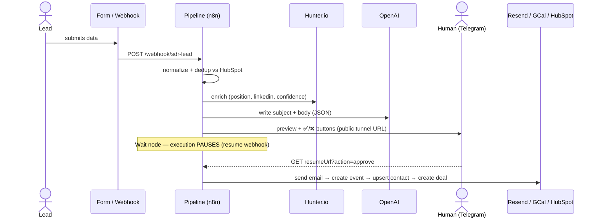

# Architecture — AI SDR Pipeline

Three n8n workflows, one contract:

| Workflow | Role |
|---|---|
| `SDR Pipeline Main` | The pipeline: intake → dedup → enrich → AI outreach → HITL → execution |
| `SDR Form Intake` | Adapter: n8n-hosted form → maps labels → POSTs to the main webhook |
| `SDR Test Trigger` | Batch adapter: reads `data/sample-leads.json` → POSTs each lead |

Every source converges on `POST /webhook/sdr-lead` with the contract
`{name, email, company, position, domain}`. Ingestion is decoupled from processing:
new sources are new adapters, never pipeline changes.

## Sequence (happy path)

## Flow graph

```mermaid
flowchart LR
    A[Lead Intake\nwebhook] --> B[Normalize Lead]
    B --> C[Dedup Check\nHubSpot search]
    C --> D[Dedup Gate\nvalidate + flag]
    D --> E{Is Duplicate}
    E -- yes --> F[Log Duplicate Skip]
    E -- no --> G[Hunter Enrich]
    G --> H[Merge Enrichment]
    G -. error .-> GE[Hunter Error Alert] --> GC[Hunter Error Continue] --> I
    H --> I[Generate Outreach\nOpenAI]
    I --> J[Parse Outreach JSON]
    I -. error .-> IE[LLM Error Alert] --> K[Fallback Outreach]
    J -. parse fail .-> K
    J --> L[Build Approval Links\ntunnel discovery]
    K --> L
    L --> M[Send Telegram Preview\ninline buttons]
    M --> N[Wait for Approval ⏸]
    N --> O{Route Decision}
    O -- approve --> P[Send Email] --> Q[Create Calendar Event] --> R[HubSpot Upsert Contact] --> S[HubSpot Create Deal]
    P -. error .-> PE[Email Error Alert] --> Q
    Q -. error .-> QE[Calendar Error Alert] --> R
    O -- reject --> T[Mark Rejected] --> U[HubSpot Rejection Note]
```

## Node-by-node

| Node | Type | v | Purpose |
|---|---|---|---|
| Lead Intake | `webhook` | 2 | `POST /sdr-lead`, `responseMode: lastNode` |
| Normalize Lead | `set` | 3.4 | Map any source's payload to the internal contract |
| Dedup Check | `httpRequest` | 4.2 | HubSpot contact search by email |
| Dedup Gate | `code` | 2 | Validate required fields + email format; flag `is_duplicate` |
| Is Duplicate | `if` | 2 | Duplicates exit early — zero API spend |
| Log Duplicate Skip | `set` | 3.4 | Terminal note for skipped duplicates |
| Hunter Enrich | `httpRequest` | 4.2 | Position, LinkedIn, email confidence (error → alert branch) |
| Hunter Error Alert / Continue | `telegram` / `set` | 1.2 / 3.4 | Notify operator; continue with `enrichment_confidence: failed` |
| Merge Enrichment | `set` | 3.4 | Lead fields + Hunter fields in one item |
| Generate Outreach | `langchain.openAi` | 1.8 | Personalized subject + body, JSON contract (prompts in `prompts/`) |
| Parse Outreach JSON | `code` | 2 | Strip fences, parse, validate keys — or throw to fallback |
| LLM Error Alert / Fallback Outreach | `telegram` / `set` | 1.2 / 3.4 | Static template — the pipeline never stalls on the model |
| Build Approval Links | `code` | 2 | Tunnel discovery + rewrite `resumeUrl` (see below) |
| Send Telegram Preview | `telegram` | 1.2 | Lead + draft preview, inline ✅/❌ URL buttons |
| Wait for Approval | `wait` | 1 | `resume: webhook`, 1h max — execution sleeps, costs nothing |
| Route Decision | `if` | 2 | `$json.query.action === "approve"` |
| Send Email | `httpRequest` | 4.2 | Resend API (error → alert, calendar still runs) |
| Create Calendar Event | `googleCalendar` | 1.3 | Next business day 10:00 — **non-fatal**: error alerts, CRM still runs |
| HubSpot Upsert Contact / Create Deal | `httpRequest` | 4.2 | Contact with `outreach_status: sent` + associated deal |
| Mark Rejected / HubSpot Rejection Note | `httpRequest` | 4.2 | Contact with `outreach_status: rejected` + note — full traceability |

## Wait/resume mechanics + the Telegram button problem

The Wait node (`resume: webhook`) parks the execution and exposes a **signed resume URL**
(`$execution.resumeUrl` → `/webhook-waiting/{id}?signature=…`). A `GET` with
`&action=approve|reject` wakes the execution exactly where it paused; the query
lands in `$json.query` for routing.

**The catch:** the resume URL is built from `WEBHOOK_URL` (localhost in dev), and
Telegram rejects `localhost` in inline keyboard buttons — it won't even linkify it
in text. The fix lives in `Build Approval Links`:

1. `scripts/start-tunnel.sh` runs a Cloudflare quick tunnel with a local metrics
   endpoint (`--metrics 127.0.0.1:20241`).
2. Per execution, the Code node fetches `http://host.docker.internal:20241/quicktunnel`,
   gets the current public hostname, and rewrites the resume URL's origin.
3. The buttons carry real public HTTPS URLs — tappable from any device. If the
   tunnel is down, the node throws a clear error instead of sending dead buttons.

The tunnel hostname is ephemeral by design; since discovery happens at runtime,
nothing needs reconfiguring between sessions.

## Error-handling philosophy

Every external call has an explicit error path (`onError: continueErrorOutput`):

| Failure | Behavior |
|---|---|
| Hunter down / no data | Alert → continue with `confidence: failed` (human judges with less info) |
| LLM error / bad JSON | Alert → static fallback template |
| Resend error | Alert → calendar + CRM still run |
| Calendar error | Alert → **CRM still runs** (the record matters most) |
| Duplicate lead | Halt before any spend |
| No approval in 1h | Wait times out — nothing is sent |

Loud failure over silent success: every error branch messages the operator on Telegram.

## Credential map

| n8n credential | Type | Used by |
|---|---|---|
| OpenAI | `openAiApi` | Generate Outreach |
| Telegram | `telegramApi` | Preview + all error alerts |
| Hunter-API | `httpQueryAuth` (`api_key`) | Hunter Enrich |
| Resend-API | `httpHeaderAuth` (Bearer) | Send Email |
| HubSpot-API | `httpHeaderAuth` (Bearer, private app) | Dedup Check, contact/deal/rejection nodes |
| Google Calendar | `googleCalendarOAuth2Api` | Create Calendar Event (OAuth — connect in UI) |

Secrets live only in n8n's encrypted credential store and `.env` (gitignored).
The workflow JSON references credentials by id/name — never by value.
